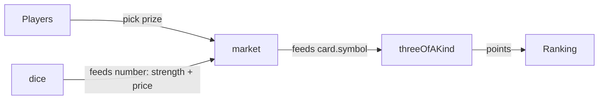

# House Rules v3: Design Specification (Compositional Mechanics)

**Status:** design only, to be reviewed before implementation. This revises v2. Anything not changed here carries over from v2.

## Changes from v2
- **Players pick recognizable micro-mechanics, and the game emerges from how they combine.** Prize/fight/goal survive only as internal structural roles used to validate a generated game.
- **Capability grammar:** mechanics declare typed ports (`provides`, `consumes`), hooks, input needs, and conflicts. The assembler derives a dependency graph from these declarations.
- **Connectivity gate:**
  - Static graph rules reject dead ends and parallel islands.
  - Simulation rejects mechanics that don't materially change decisions or outcomes.
- **Cohesion report** for every generated game: dependency graph, main loop, per-mechanic influence, and a criteria scorecard.
- **Catalogue split:** v2's 13 bundled modules become 16 smaller mechanics (see the migration table).
- **Configurable Set policy:** automatic ramp (A), player-directed add/replace/keep ballots (B), or alternating between them for playtests.
- **Teaching deltas:** one mechanic line plus at most one connection line, generated from the graph.
- **Generic bots replace per-module bots:**
  - a lookahead bot that uses the engine as its forward model,
  - a TipBot built from mechanic tips,
  - trivial constant-policy bots.
- **Tie rule clarified:** tied claims cancel each other and the best remaining claim wins. v2 voided the whole prize. Several emergent games depend on this.
- **"Beat" is renamed "turn" everywhere,** since players see "turn."
- **New spec content:** ten design criteria with static, simulated, and playtest enforcement; seven worked examples; three rejected counter-examples.

## Context
- Players vote rules into existence, play a ~2-minute round, vote a change, and play again. It's Mario Party where the group builds the minigames.
- **The fantasy:** pick small, familiar mechanics, then discover the game they make together. Part of the fun is surprising interactions ("lowest wins *and* ties cancel? Then nobody should bid 1").
- **Why an engine:** mechanics recombine, so each new one multiplies the playable games, and the quality gate keeps only coherent, tested combinations on ballots.

## Design pillars
1. **About two minutes of play per round.** Every decision has a visible consequence within 2 turns. No end-game scoring.
2. **Everyone acts at once.**
3. **One new thing per round.** Teach only the delta.
4. **No designer jargon.**
5. **Every combination is coherent.** Roles guarantee structure, the graph guarantees connection, and the simulator guarantees it plays well.
6. **Votes matter but don't dictate.**
7. **Mastery lives in the vocabulary.** A mechanic's name, icon, and rule never change between combinations.
8. **Scoring is always live.**
9. **Mechanics must touch.** Every selected mechanic feeds, changes, or competes with another selected mechanic, and sits on the loop from a player decision to the score.
10. **Emergence over authorship.** Prefer small rules whose combinations produce behaviors none of them describe.

## Structure: Session → Set → Round → Turn
- **Session** (~30 min): several Sets. Most Stars wins.
- **Set** (players see "game"): one evolving game, made of an opener plus mutations under the configured Set policy.
- **Round:** [ballot → reel → teach] → play (~2 min) → results. Under policy B, the bracketed part can be skipped.
- **Turn** (~11 s): simultaneous input window (a `prepare` phase for toggles, then `commit`), reveal, resolve.

| Phase | Max |
|---|---|
| Ballot | 15 s |
| Reel | 4 s |
| Teach, opener | 15 s |
| Teach, mutation | 10 s |
| Play | 120 s cap (~10 turns × 8 s input + 3 s reveal) |
| Results (moment caption, optional rating) | 10 s |

- **Non-play time** must stay ≤ 40 s in mutation rounds and ≤ 45 s in opener rounds.
- Practice turns count as play.
- The session intro (≤ 20 s) is excluded from these budgets.

### Player-facing glossary
| Internal | Players see |
|---|---|
| Set | game |
| turn | turn |
| claim strength (`number`) | your number |
| claim strength (`speed`) | fastest tap |
| mechanic | only its name, e.g. "Market" |
| out player (Hearts) | "players who are out" |
| moment | "Moment of the round" |

## Composition model

### Three layers
1. **Frame** (always on, taught once per session): turn loop, simultaneous input, prize picking, claim comparison, tie cancelling, live ranking, default ending.
2. **Micro-mechanics** (what players vote on): small, recognizable rules. Each one:
   - is teachable in one sentence of ≤ 12 words,
   - creates a visible consequence within 2 turns,
   - composes only through declared ports and hooks.
3. **Structural roles** (internal validation only): the assembler checks that the selected mechanics cover every role. Roles are never shown to players and are never ballot categories.

| Role | Covered when | v2 equivalent |
|---|---|---|
| `stakes` | ≥ 1 mechanic provides `prize` | prize |
| `contest` | ≥ 1 mechanic provides claim strength (`number` or `speed`) | fight |
| `score` | ≥ 1 mechanic provides `points` | goal (scoring half) |
| `end` | ≤ 1 mechanic provides `end`; otherwise the frame's timer ending applies | goal (ending half) |
| `decision` | ≥ 1 player input per turn with ≥ 2 outcome-changing options | new |

### What stays structural, and why
- **Comparison and tie cancelling:** the game's signature, taught once. Voting on it every Set would waste ballots and break mastery. `Lowest Wins` can still flip the comparison as a mechanic.
- **Prize picking, turn timing, live ranking, default ending:** every game needs them, and nobody would vote for them.
- **Everything else is a micro-mechanic,** including things v2 hid inside modules: rerolling, busting, rent, matching, freezing, and persistent bonuses.

### Frame rules (session intro, player-facing)
1. "Everyone takes their turn at the same time."
2. "Pick a prize. Highest number wins it."
3. "Tied numbers cancel out. The best one left wins."
4. "Most points when time runs out wins."

- A mechanic whose teach line replaces a frame line (Quick Grab and Lowest Wins for line 2, endings for line 4) needs no extra text.
- A CHANGED line is only needed when a mutation alters a frame line without saying so, e.g. removing Lowest Wins gives "Highest number wins again."

**Resolution, per prize:**
1. Collect claims.
2. Drop claims that fail requirements (e.g. price) and claims with number 0.
3. Compare strength (highest by default).
4. Remove every group of tied claims.
5. The best remaining claim wins.
6. Emit `win`, `lose`, and `tie` events.

## Capability grammar
The grammar is small and explicit. It is not a scripting language: mechanics are TypeScript with declared metadata, and the grammar only describes what flows between them.

### Port types
| Port | Meaning | Combine rule (several providers) | Player noun |
|---|---|---|---|
| `number` | a player's value this turn (attrs: `random`, `chosen`, `hidden`) | summed per player, then modifiers applied | "your number" |
| `speed` | tap order this turn | at most one provider; replaces number comparison | "fastest tap" |
| `points` | live score; consumers may `spend` it | additive | "points" |
| `card` | a held item (attr: `symbol`) | collection per player | "cards" |
| `square` | an owned board space (attrs: `symbol`, `owner`) | collection per player | "squares" |
| `prize` | something on offer this turn (attrs: `payload`, `value`) | union of all offers | "prize" |
| `win`, `lose`, `tie` | results of resolving a prize | event stream | — |
| `modifier` | a change to a future number, comparison, win, or turn | applied in priority order at its hook | — |
| `end` | an ending condition | at most one provider | — |

- **Reserved, unused in v3:** `info` (hidden knowledge, peeking) and `coins` (persistent non-score currency).
- **Attribute requirements** make consumers precise. Examples: Three of a Kind consumes `card.symbol | square.symbol`; Freeze consumes `prize.value` with `maxAtLeast: 3`.

### Edge types
- **`feeds`:** a provider port matches a consumer port. Example: Dice `number` → Market.
- **`modifies`:** a modifier changes another mechanic's port or resolution. Example: Reroll → Dice.
- **`competes`:** two mechanics consume the same resource and at least one spends it. Examples: Three of a Kind and Rent both use cards; Bidding and First to X both use points.

All three edge types count for connectivity.

### How the brief's vocabulary maps to the grammar
| Brief term | Grammar |
|---|---|
| numbers, randomness | `number` with `random` or `chosen` |
| currency | `points` consumed with `spend` (`coins` reserved) |
| cards, sets | `card` with `symbol`; Three of a Kind turns symbols into `points` |
| ownership | `square` with `owner` |
| targeting | the frame's `pickPrize` input |
| timing | `speed` |
| risk | `costlyEntry`, trait `risk`, bust/sit-out modifiers |
| contention | frame resolution + `competes` edges |
| information | `info` (reserved) |
| score, objects, modifiers | `points`, `card`/`square`, `modifier` |

### Mechanic metadata
```ts
type PortType = 'number' | 'speed' | 'points' | 'card' | 'square' | 'prize'
              | 'win' | 'lose' | 'tie' | 'modifier' | 'end';

interface PortDecl {
  type: PortType | PortType[];                       // array = any of
  attrs?: Record<string, string | number | boolean>;
  required?: boolean;                                // consumes only
  optional?: boolean;                                // provides only: may go unconsumed (events)
  use?: 'strength' | 'price' | 'spend' | 'read';     // how a consumer uses it
}

type HookPoint = 'turnStart' | 'beforeInput' | 'afterInput' | 'beforeResolve'
               | 'afterResolve' | 'onWin' | 'onLose' | 'onTie' | 'onScore' | 'turnEnd';

interface PlayerInputDecl {
  kind: 'pickNumber' | 'pickAmount' | 'toggle' | 'tap';
  phase: 'prepare' | 'commit';
  hidden: boolean;
  realtime: boolean;
}

interface MechanicMeta {
  id: string;
  roles: Array<'stakes' | 'contest' | 'score' | 'end'>;   // empty = pure modifier
  provides: PortDecl[];                                   // the brief's "provides" and "produces"
  consumes: PortDecl[];                                   // the brief's "consumes/requires"
  hooks: HookPoint[];
  input: PlayerInputDecl | null;                          // pickPrize comes from the frame
  traits: Array<'random' | 'risk' | 'hidden' | 'realtime' | 'persistent'>;  // variety and conflicts
  costlyEntry?: boolean;                                  // entering a contest costs something, so "pass" is a real choice
  conflicts: string[];                                    // mechanic ids
  complexity: 1 | 2 | 3;
  payoffLatencyTurns: 0 | 1 | 2;                          // decision → visible consequence that counts toward score
  scoringTiming: 'live';
  priority: number;                                       // order within a hook point
  tunableParams: string[];
  neutralStub: string;                                    // behavior used by materiality tests
}
```

### Turn pipeline and hooks
1. `turnStart`: prizes offered, dice rolled, sit-outs applied.
2. `beforeInput` → input window (`prepare` toggles, then `commit`: prize pick, secret numbers, bids, taps) → `afterInput`.
3. `beforeResolve`: strength computed (numbers summed, modifiers applied).
4. Frame resolution → `onWin`, `onLose`, `onTie`.
5. `afterResolve`: payloads transfer, bids are paid, jackpots move, sit-outs are marked.
6. `onScore`: fires on every points change (matches, race finish).
7. `turnEnd`: rent, heart checks, end check.

A mechanic may only consume a port at or after the hook where that port's provider publishes it.

### Input model
- The frame adds `pickPrize` whenever prizes exist. "Pass" is always allowed.
- A turn is either **simultaneous** (hidden commits) or **realtime** (taps), never both. `prepare` toggles work in both.
- At most 2 mechanic inputs per turn, besides `pickPrize`.

## Assembler: static composition rules
The assembler turns a list of mechanic ids into a validated game: edges, hook order, teach text, and dependency graph.

### Edge derivation
- `feeds` edges come from matching ports. Every prize mechanic consumes claim strength:
  - normally, every `number` provider feeds every prize;
  - if a `speed` provider exists, `speed` feeds the prizes instead, and numbers feed only non-strength consumers such as `price`.
- `modifies` edges connect a modifier to the mechanic whose port or resolution it changes.
- `competes` edges connect consumers of the same resource where one spends it.
- **Two terminals:**
  - `Players` → every mechanic with an input, and → prizes via `pickPrize`;
  - `Ranking` ← every `points` and `end` provider.

### Validation rules
| # | Rule | Rejects, for example |
|---|---|---|
| R1 | Every `required` consume has a provider | Rent with nothing to own |
| R2 | Every non-optional provide has a consumer (`points`/`end` → Ranking, `prize` → Players) | Board with nothing using squares |
| R3 | Every mechanic has a directed path to Ranking | an effect that never reaches score |
| R4 | The graph of selected mechanics, with both terminals removed, is connected | parallel games that only meet in the final score |
| R5 | Every mechanic has ≥ 1 edge to another selected mechanic | standalone bookkeeping ("everyone gains 1 point") |
| R6 | All roles covered; ≤ 1 `end`; ≤ 1 `speed` | incomplete games |
| R7 | A decision exists: `pickPrize` with ≥ 2 prizes, a mechanic input, or passing against a `costlyEntry` mechanic | games that play themselves |
| R8 | No conflicts; input model respected | Quick Grab + Bidding |
| R9 | Hook order respected | same-turn cycles |
| R10 | Some decision → score path has summed `payoffLatencyTurns` ≤ 2 | slow payoffs |
| R11 | Teachable: every new mechanic that needs a connection line has a template, and budgets are met (≤ 1 CHANGED line) | unexplainable combinations |
| R12 | 2–6 mechanics; complexity within the active Set policy | overload |

- Static rules are necessary but not sufficient: a mechanic can be connected and still irrelevant. Simulation decides materiality.
- Rejections are specific and developer-facing, e.g. `R2: board.square has no consumer (candidates: rent, threeOfAKind)`. The director uses those candidate lists to know which additions become possible later.

## Cohesion report
Generated for every game the simulator evaluates (`reports/games/<hash>/cohesion.md` and `.json`), and viewable in the dev table. It contains:
1. Player-facing name, mechanics, player count, verdict.
2. Dependency graph (Mermaid), with edges labeled by port and simulated flow share.
3. Main loop paths from `Players` to `Ranking`.
4. Per mechanic: roles, edges in and out, provenance share, decision influence, outcome influence, verdict.
5. Per edge: type, port, flow per round, ablation effect.
6. Criteria scorecard (1–10) with metric values.
7. Teach text (opener or delta) with word counts and read time.
8. Top 3 simulated moments with captions.
9. Warnings for metrics within 10% of a threshold.

Example graph (Worked Example 1):


## Catalogue v3 (16 micro-mechanics; do not add more yet)
- **Word limits:** name ≤ 4 words, teach ≤ 12, tip ≤ 12.
- **Column key:** Cx = complexity, Lat = `payoffLatencyTurns`.

### Prizes
| id | Name | Teach | Provides | Consumes | Cx | Lat | Notes | Neutral stub |
|---|---|---|---|---|---|---|---|---|
| `pot` | Pot | A pot of points grows every turn until someone wins it. | `prize{points}`, `points`, events | strength | 1 | 0 | Starts at 2, +1 per unwon turn (tunable), resets after a win | fixed 2-point pot |
| `market` | Market | Cards for sale each turn. Your number must reach a card's price. | `prize{card, value: price}`, `card{symbol}`, events | `number` (price, required), strength | 2 | 0 | Offer size and price range auto-tuned from the combined number distribution | no prices |
| `board` | Board | Win squares on the board. Anyone can take them from you. | `prize{square, value: 1}`, `square{symbol, owner}`, events | strength | 2 | 0 | Grid scales with players; a few squares open each turn, owned ones included | owned squares can't be retaken |

### Claim strength
| id | Name | Teach | Provides | Consumes | Cx | Lat | Notes | Neutral stub |
|---|---|---|---|---|---|---|---|---|
| `dice` | Dice | Everyone rolls two dice at the start of each turn. | `number{random}` | — | 1 | 0 | Auto-roll, shown on your phone | everyone rolls 7 |
| `secretNumbers` | Secret Numbers | Secretly pick 1, 2, or 3. Each returns after all are used. | `number{chosen, hidden}` | — | 1 | 0 | `pickNumber` (commit, hidden); costlyEntry | everyone plays 2 |
| `bidding` | Bidding | Secretly bid points. Only the winner pays their bid. | `number{chosen, hidden}` | `points` (spend, required) | 2 | 0 | `pickAmount`; players start with 5 points; costlyEntry | bids are free |
| `quickGrab` | Quick Grab | Tap a prize to grab it. Fastest tap wins, not highest number. | `speed` | — | 1 | 0 | `tap` (realtime); prizes unlock after a random delay; taps within 150 ms tie; conflicts: secretNumbers, bidding, lowestWins | random claim order |

### Scoring
| id | Name | Teach | Provides | Consumes | Cx | Lat | Notes | Neutral stub |
|---|---|---|---|---|---|---|---|---|
| `threeOfAKind` | Three of a Kind | Three matching symbols score 5 points, then go back. | `points` | `card.symbol` or `square.symbol` (spend, required) | 1 | 0 | Progress shows immediately; matched cards return to the Market deck, matched squares become unowned | each card/square scores 1 when gained |
| `rent` | Rent | Everything you own pays 1 point every turn. | `points` | `card` or `square` (read, required) | 1 | 1 | Paid at `turnEnd` | things score 1 once when gained |

### Endings
| id | Name | Teach | Provides | Consumes | Cx | Lat | Notes | Neutral stub |
|---|---|---|---|---|---|---|---|---|
| `raceTo` | First to X | First to X points wins right away. | `end` | `points` | 1 | 0 | X auto-tuned per game and player count | frame timer ending |
| `hearts` | Hearts | Gain the fewest points between checks, lose a heart. Last alive wins. | `end`, `modifier(win)` | `points`, `win` | 2 | 2 | Check every 2 turns; tied fewest lose nothing; 2–4 hearts (tuned). Out players keep playing: their wins cancel the prize, and each cancel earns them 1 vote token | frame timer ending |

### Modifiers
| id | Name | Teach | Provides | Consumes | Cx | Lat | Notes | Neutral stub |
|---|---|---|---|---|---|---|---|---|
| `reroll` | Reroll | You may reroll once. Doubles on a reroll bust. | `modifier(number)` | `number{random}` | 1 | 0 | `toggle` (prepare); a bust sets your number to 0; costlyEntry | no rerolls |
| `powerUp` | Power Up | Every win adds 1 to your number, up to 3. | `modifier(number)` | `win`, `number` | 1 | 1 | Lasts the round | no bonus |
| `jackpot` | Jackpot | Each tie adds 2 to the jackpot. Next winner takes it. | `points` | `tie`, `win` | 1 | 1 | With several wins in one turn, the winner of the highest-value prize takes it | no jackpot |
| `lowestWins` | Lowest Wins | The lowest number wins a prize instead of the highest. | `modifier(comparison)` | `number` (strength) | 1 | 0 | A number of 0 (pass, bust) can't win; conflicts: quickGrab | highest wins |
| `freeze` | Freeze | Win a prize worth 3 or more, and sit out a turn. | `modifier(turn)` | `win`, `prize.value{maxAtLeast: 3}`; costlyEntry | 1 | 1 | Threshold is tunable and filled into the text | no sit-out |

### Tips (one per mechanic; also TipBot heuristics)
| Mechanic | Tip |
|---|---|
| Pot | "Let others fight over it while it grows." |
| Market | "Cheap cards nobody wants are free wins." |
| Board | "Take squares from the leader, not empty ones." |
| Dice | "Aim low rolls at prizes nobody else wants." |
| Secret Numbers | "When big numbers tie, a small one sneaks the win." |
| Bidding | "Bid just enough. Big wins can cost more than they pay." |
| Quick Grab | "Grab the prize you can use, not the biggest." |
| Three of a Kind | "Watch what others collect, and take their third symbol." |
| Rent | "Early buys pay the longest." |
| First to X | "Near the finish, stop spending and start blocking." |
| Hearts | "You don't need the most points, just not the fewest." |
| Reroll | "Reroll when your roll can't win anything anyway." |
| Power Up | "Early small wins grow into big ones." |
| Jackpot | "After a big tie, any win pays extra." |
| Lowest Wins | "Pick numbers others won't." |
| Freeze | "Grab small prizes while big winners sit out." |

### Connection templates
| Edge | Line |
|---|---|
| dice feeds strength | "Your dice total is your number." |
| bidding feeds strength | "Your bid is your number." |
| second number provider | "Your {second} adds to your {first}." (e.g. "Your bid adds to your dice.") |
| card feeds threeOfAKind | "Cards come from the Market." |
| square feeds threeOfAKind | "Your squares count as matching symbols." |
| card feeds rent | "Cards you hold pay rent." |
| square feeds rent | "Squares you own pay rent." |
| reroll modifies dice → market | "A bust means you can't buy this turn." |
| powerUp modifies number → market | "Your bonus counts toward prices." |
| lowestWins modifies market | "You still need to reach the price." |
| lowestWins modifies bidding | "The lowest bid wins, and still pays." |
| freeze reads pot value | "A pot's worth is its points." |
| freeze reads market value | "A card's worth is its price." |
| hearts modifies prizes | "Players who are out can still win prizes to cancel them." (essential) |
| bidding competes with raceTo | "Points you bid come off your total." |

**Selection rule:** each new mechanic gets at most one connection line.
1. Use the edge marked `essential` (it changes a rule).
2. Otherwise, use the edge with the highest simulated flow share.
3. Omit the line if the teach text already names the connected thing.

### v2 → v3 migration
| v2 module | v3 |
|---|---|
| Growing Pot | Pot |
| Matching Cards | Market + Three of a Kind |
| Claim the Board | Board + Rent |
| Secret Numbers | Secret Numbers (comparison and ties moved to the frame) |
| Roll for It | Dice + Reroll (the bust lives in Reroll; comparison moved to the frame) |
| Grab & Freeze | Quick Grab + Freeze (Freeze now works with any claim type) |
| Most Points | frame default ending |
| First to X | First to X |
| Last One Standing | Hearts |
| Jackpot Ties | Jackpot (flat 2 per tie, independent of prize type) |
| Winning Powers You Up | Power Up (one generic rule on `number`, no per-fight versions) |
| Double or Nothing | removed for now: doubling payouts doesn't generalize across payload types |
| Rob the Leader | removed for now; revisit with a take-that port |
| — | new: Bidding, Lowest Wins |

## What makes a good generated game
| # | Criterion | Static check | Simulation check | Playtest signal |
|---|---|---|---|---|
| 1 | Explainable quickly | teach budgets, templates exist (R11) | — | first-turn timeouts |
| 2 | Meaningful choice in the first turn | decision exists (R7) | first-turn choice rate ≥ 80%: players have ≥ 2 options whose lookahead values differ | first-turn passes and timeouts |
| 3 | Immediate or near-immediate feedback | a score path with latency ≤ 2 (R10) | median turns to first visible consequence ≤ 1; median turns to first points ≤ 4 | — |
| 4 | Selected mechanics materially interact | R3–R5 | every mechanic has ≥ 1 material edge | — |
| 5 | No mechanic exists only as bookkeeping | R5 | decision influence ≥ 10% for every mechanic | — |
| 6 | No dominant trivial action | — | no trivial bot beats its fair share by > 5 pp against lookahead bots; no single action is > 60% of lookahead choices while winning | — |
| 7 | Basic strategy within 1–2 turns | every mechanic has a tip | TipBot ≥ 1.2× fair share vs random, and ≥ 70% of the lookahead bot's win rate | ratings |
| 8 | Mutations change strategy without relearning | delta ≤ 2 lines + ≤ 1 CHANGED | strategy shift ≥ threshold, and TipBot competence holds after the change | ratings after mutations |
| 9 | Rankable if interrupted | `scoringTiming: 'live'` | ranking is valid at every logged event | — |
| 10 | At least one memorable emergent interaction | a graph path spans ≥ 3 selected mechanics | median ≥ 1 cross-mechanic moment per round | moment captions, ratings |

A game is offered only if every static and simulation check passes for the current player count.

## Teaching
- **Session intro** (once, ≤ 20 s): the 4 frame lines, plus voting and tokens.
- **Opener:** each mechanic's teach line, plus at most one connection line per mechanic after the first. Limits: ≤ 6 lines, ≤ 60 words, ≤ 15 s.
- **Mutation delta:**
  ```
  NEW: THREE OF A KIND
  "Three matching symbols score 5 points, then go back."
  "Cards come from the Market."
  ```
  - **Add:** a NEW block (teach line + ≤ 1 connection line).
  - **Replace:** the old card crossed out (GONE), then the NEW block.
  - **Keep** (policy B): "Same game, one more round." shown for 2 s.
  - **Frame changes:** a frame line changed without its own teach text becomes one CHANGED line. A mutation needing more than one CHANGED line is rejected (R11).
- **Practice turn:** at Set start, and whenever a mutation adds or removes a player input. It shows the new mechanic's tip.
- **Phones show legal moves only,** with one instruction line.
- **Host rules strip:** current teach cards shown as icons.
- **Moment of the round** on the results screen: a caption generated from the biggest cross-mechanic swing, e.g. "Sam took the third moon with an 8 while two 10s cancelled." It teaches interactions by showing them.
- **Teach duration** = read time at 250 wpm + 3 s, capped as above.
- **Teaching signal:** timeouts after a mutation are flagged in the playtest log.

## Player vocabulary
- **Strings live per mechanic** in `strings.ts`: name, teach, tip, owned connection templates, moment caption templates, input labels, name fragments.
- **Jargon lint** fails the build on:
  - **internal terms:** mechanic, micro-mechanic, module, capability, port, provides, consumes, role, skeleton, slot, frame, hook, graph, dependency, chain, connectivity, provenance, ablation, stub, beat, stake, rule set;
  - **designer terms:** worker placement, area control, area majority, engine building, tableau, draft, deck building, sealed bid, push your luck, set collection, action selection, take that, victory points, VP.
- **Word limits:** name ≤ 4, teach ≤ 12, tip ≤ 12, connection ≤ 12, pitch ≤ 15, caption ≤ 20.
- **Icons:** a stable icon and color per mechanic.
- **No shared nouns:** two mechanics never use the same player noun for different things. That's why "Number Cards" became Secret Numbers: the Market already has cards.

## Voting
- **Unchanged from v2:** secret votes, underdog ×2 weight, tokens (+1 weight for 1 token, a veto for 2), weighted reel with a 10% minimum slice, server-side seeded result, co-author credits.
- **Ballot cards** show the mechanic's icon, name, and teach line. Connection lines appear only on the teach screen.

### Mutation operators
| Operator | Meaning | Allowed in |
|---|---|---|
| `add(m)` | add one mechanic | A, B |
| `replace(old, new)` | swap one mechanic | A, B |
| `remove(m)` | drop one mechanic | B, if `allowRemove` |
| `keep` | no change | B |

- A ballot option applies exactly one operator.
- An addition that needs a partner (e.g. Board with no Rent or Three of a Kind in the game) is never generated. The assembler's candidate lists show which additions open up later.

### Option generation
1. Generate candidates with the operators the policy allows.
2. Filter in order: static rules → cached simulation verdict for the current player count → mutation checks (strategy shift, TipBot competence, teach delta).
3. Apply the policy's budgets.
4. Rank by:
   - **connection gain:** more new material edges ranks higher;
   - **variety:** mechanics not yet seen this session, then operators not used last round.
5. If fewer than 2 options remain, relax variety first, then budget +1. Never relax the gates.

### Set policies (configurable; neither is assumed more fun)

**A. Automatic ramp (`autoRamp`)**
- Round 1: opener ballot with 3 vetted base games of 2–3 mechanics.
- Rounds 2–4: one ballot per round.
  - The director picks the operator (add or replace) that follows the complexity budget, default `[4, 5, 6, 7]`.
  - All 3 options on a ballot share that operator.

**B. Player-directed (`playerDirected`)**
- Round 1: the same opener ballot.
- Every `ballotEvery` rounds: one **mixed ballot**, by default one ADD, one REPLACE, and one KEEP option. Players control growth directly.
- **Limits:** complexity ceiling (default 9), 2–6 mechanics. KEEP is always offered; ADD disappears at the ceiling.
- **Variant `layout: twoStep`:** an instant majority direction vote (no reel), then an option ballot. It has its own non-play budget (≤ 50 s) and is flagged in logs.

**Alternate (`alternate`):** switches policy each Set, so one playtest group experiences both.

### Making policies playtestable
- **Ratings** (optional): one tap on phones during results ("Fun? 👍 👎"), and after each Set ("Play this game again?").
- **Playtest log:** policy, operators offered and chosen, complexity per round, ratings, timeouts, moments.
- **`pnpm playtest:compare`:** summarizes by policy (ratings, KEEP rate, final complexity, teach timeouts, round-to-round rating trend).
- **Bot sessions** compare policies only on mechanics-level measures (complexity trajectories, teach load). Fun is decided by humans.

## Worked examples
- The session intro (frame lines 1–4) is assumed in every example.
- **Teach** is the full current rules strip as players see it. **Mutation** is the delta screen.
- Complexity is the sum of mechanic weights. All paths fit policy A's budget `[4, 5, 6, 7]`.

### 1. Dice Market Matches (standard)
- **Mechanics:** Dice, Market, Three of a Kind. Complexity 4, opener.
- **Skeleton:** stakes = Market · contest = Dice · score = Three of a Kind · end = frame timer.
- **Chain:** `Dice —feeds number (strength + price)→ Market —feeds card.symbol→ Three of a Kind —points→ Ranking`
- **Teach:**
  - DICE: "Everyone rolls two dice at the start of each turn."
  - "Your dice total is your number."
  - MARKET: "Cards for sale each turn. Your number must reach a card's price."
  - THREE OF A KIND: "Three matching symbols score 5 points, then go back."
  - "Cards come from the Market."
- **A turn:**
  1. Your phone shows "You rolled 9" and highlights cards priced 9 or less.
  2. Pick one, or pass.
  3. Reveal: for each card, the highest qualifying total wins, and tied totals cancel.
  4. Completed matches score immediately.
- **Why they interact:**
  - The roll decides which cards you can contest at all.
  - Market scarcity turns symbols into a denial race.
  - Symbols are the cards' only value.
  - Remove any link and the decisions disappear.
- **Mutation (ADD Reroll):**
  - NEW: REROLL "You may reroll once. Doubles on a reroll bust."
  - "A bust means you can't buy this turn."
  - **Strategy shift:** mid rolls gamble for pricier cards, and denying someone's third symbol now risks a bust.

### 2. Rent War (standard)
- **Mechanics:** Board, Bidding, Rent. Complexity 5.
- **Reached by:** opener Board + Dice + Rent, then REPLACE Dice with Bidding.
- **Skeleton:** stakes = Board · contest = Bidding · score = Rent · end = timer.
- **Chain:** `Rent —feeds points (spend)→ Bidding —feeds number→ Board —feeds square→ Rent —points→ Ranking` (a loop across turns).
- **Teach:**
  - BOARD: "Win squares on the board. Anyone can take them from you."
  - BIDDING: "Secretly bid points. Only the winner pays their bid."
  - "Your bid is your number."
  - RENT: "Everything you own pays 1 point every turn."
  - "Squares you own pay rent."
- **A turn:**
  1. Three squares light up, often including one someone owns.
  2. Pick a square and a bid.
  3. The highest bid left after ties cancel takes the square and pays.
  4. Everyone collects rent.
- **Why they interact:** rent funds bids and bids buy rent, so every bid trades score now for score later. Retakes make the leader's income everyone's target.
- **Mutation (ADD First to X):**
  - NEW: FIRST TO 25 "First to 25 points wins right away."
  - "Points you bid come off your total." (a `competes` edge)
  - **Strategy shift:** late in the round investing stops paying, so players hoard and bid only to block the leader.

### 3. Speed Shopping (realtime)
- **Mechanics:** Quick Grab, Dice, Market, Rent. Complexity 5.
- **Reached by:** opener Dice + Market + Rent, then ADD Quick Grab.
- **Skeleton:** stakes = Market · contest = Quick Grab · score = Rent · end = timer.
- **Chain:** `Dice —feeds number (price only)→ Market`, `Quick Grab —feeds speed (strength)→ Market`, `Market —feeds card→ Rent —points→ Ranking`
- **Teach:**
  - DICE: "Everyone rolls two dice at the start of each turn."
  - "Your dice total is your number."
  - MARKET: "Cards for sale each turn. Your number must reach a card's price."
  - RENT: "Everything you own pays 1 point every turn."
  - "Cards you hold pay rent."
  - QUICK GRAB: "Tap a prize to grab it. Fastest tap wins, not highest number."
- **A turn:**
  1. Dice roll automatically, and the cards unlock a moment later.
  2. You can only tap cards within your roll.
  3. The first valid tap wins; taps within 150 ms cancel.
  4. Rent pays at turn end.
- **Why they interact:** the roll sorts players into different races. High rollers fight each other over expensive cards while a low roller takes the cheap one uncontested. Rent makes early grabs compound, so speed now is worth more later.
- **Mutation (ADD Freeze):**
  - NEW: FREEZE "Win a prize worth 3 or more, and sit out a turn."
  - "A card's worth is its price."
  - **Strategy shift:** an expensive card now costs your next race, so high rollers weigh card value against tempo.

### 4. Lowest Unique Bid (unusual)
- **Mechanics:** Pot, Bidding, Lowest Wins. Complexity 4.
- **Reached by:** opener Pot + Bidding, then ADD Lowest Wins.
- **Skeleton:** stakes = Pot · contest = Bidding · score = Pot · end = timer · modifier = Lowest Wins.
- **Chain:** `Bidding —feeds number→ Pot —points→ Ranking`, `Pot —feeds points (spend)→ Bidding`, `Lowest Wins —modifies comparison→ Pot`
- **Teach:**
  - POT: "A pot of points grows every turn until someone wins it."
  - BIDDING: "Secretly bid points. Only the winner pays their bid."
  - "Your bid is your number."
  - LOWEST WINS: "The lowest number wins a prize instead of the highest."
  - "The lowest bid wins, and still pays."
- **A turn:**
  1. Choose a bid; 0 sits out.
  2. Reveal: matching bids cancel, and the lowest bid left wins the pot and pays.
  3. If every bid cancels, the pot grows.
- **Why this is emergent:** no rule mentions uniqueness, yet the whole game is about being alone on a small number.
  - Lowest Wins makes bids cheap.
  - The tie rule makes the obvious bid of 1 self-defeating.
  - The growing pot punishes crowding.
  - Bidding's cost stops players from simply climbing.
- **Moment:** three players bid 1 to play it safe, cancel out, and a fourth takes a 7-point pot for 2.
- **Mutation (ADD Jackpot):**
  - NEW: JACKPOT "Each tie adds 2 to the jackpot. Next winner takes it."
  - **Strategy shift:** crowds become worth feeding. Players steer others onto the same number, then take the jackpot next turn.

### 5. Just Enough (unusual; continues Example 1)
- **Mechanics:** Dice, Reroll, Market, Lowest Wins, Three of a Kind. Complexity 6.
- **Reached by:** Example 1, then ADD Reroll, then ADD Lowest Wins.
- **Skeleton:** stakes = Market · contest = Dice · score = Three of a Kind · end = timer · modifiers = Reroll, Lowest Wins.
- **Chain:** `Reroll —modifies→ Dice —feeds number→ Market ←modifies— Lowest Wins`, `Market —feeds card.symbol→ Three of a Kind —points→ Ranking`
- **Teach:**
  - DICE: "Everyone rolls two dice at the start of each turn."
  - "Your dice total is your number."
  - MARKET: "Cards for sale each turn. Your number must reach a card's price."
  - THREE OF A KIND: "Three matching symbols score 5 points, then go back."
  - "Cards come from the Market."
  - REROLL: "You may reroll once. Doubles on a reroll bust."
  - "A bust means you can't buy this turn."
  - LOWEST WINS: "The lowest number wins a prize instead of the highest."
  - "You still need to reach the price."
- **A turn:**
  1. See your roll, and reroll in the first 3 seconds if you dare.
  2. Pick a card you can reach.
  3. Reveal: among players who reach the price, the lowest total wins; tied totals cancel.
- **Why this is emergent:** the price becomes a target instead of a hurdle, since the best roll is exactly the price.
  - A big roll is now a problem, so Reroll flips from chasing higher to fishing lower without dropping under the price.
  - The doubles bust still hangs over every reroll.
  - Symbols still decide which card you aim for.
- **Moment:** a player holding 12 rerolls for the third moon, lands 8, and beats a 10 and an 11.
- **Mutation (REPLACE Three of a Kind with Rent):**
  - GONE: THREE OF A KIND
  - NEW: RENT "Everything you own pays 1 point every turn."
  - "Cards you hold pay rent."
  - **Strategy shift:** symbols stop mattering, and the fight moves to hitting the cheapest price exactly, as early as possible.

### 6. Hoard or Cash In (shared-resource tension)
- **Mechanics:** Secret Numbers, Market, Rent, Three of a Kind. Complexity 5.
- **Reached by:** opener Secret Numbers + Market + Three of a Kind, then ADD Rent.
- **Skeleton:** stakes = Market · contest = Secret Numbers · score = Rent + Three of a Kind · end = timer.
- **Chain:** `Secret Numbers —feeds number→ Market —feeds card→ Rent —points→ Ranking`, `Market —feeds card.symbol→ Three of a Kind —points→ Ranking`, `Three of a Kind —competes (spends cards)— Rent`
- **Teach:**
  - SECRET NUMBERS: "Secretly pick 1, 2, or 3. Each returns after all are used."
  - MARKET: "Cards for sale each turn. Your number must reach a card's price."
  - THREE OF A KIND: "Three matching symbols score 5 points, then go back."
  - "Cards come from the Market."
  - RENT: "Everything you own pays 1 point every turn."
  - "Cards you hold pay rent."
- **A turn:**
  1. Pick a card and a secret number; used numbers are greyed out.
  2. Reveal: among players who reach the price, the highest number wins; ties cancel.
  3. Matches score 5 and return their cards.
  4. Every held card pays 1 at turn end.
- **Why they interact:** Rent and Three of a Kind reward opposite things with the same cards: holding versus completing.
  - Buying your own third symbol scores 5 but ends 3 points of rent per turn.
  - Skipping it may hand the card to an opponent.
  - The hand cycle decides when your 3 is available for the card that matters.
- **Moment:** a player skips the third star to protect their rent, and the next player takes it to finish their own match.
- **Mutation (ADD Power Up):**
  - NEW: POWER UP "Every win adds 1 to your number, up to 3."
  - "Your bonus counts toward prices."
  - **Strategy shift:** early wins unlock pricey cards and strengthen every number you play, so the table must contest the first few turns.

### 7. Ghost Bodyguards (unusual)
- **Mechanics:** Board, Secret Numbers, Rent, Hearts. Complexity 6.
- **Reached by:**
  - policy A: opener Board + Secret Numbers + Rent, ADD First to X, then REPLACE First to X with Hearts;
  - policy B: ADD Hearts directly.
- **Skeleton:** stakes = Board · contest = Secret Numbers · score = Rent · end = Hearts.
- **Chain:** `Secret Numbers —feeds number→ Board —feeds square→ Rent —feeds points→ Hearts —end→ Ranking`, `Hearts —modifies (out players' wins cancel)→ Board`
- **Teach:**
  - BOARD: "Win squares on the board. Anyone can take them from you."
  - SECRET NUMBERS: "Secretly pick 1, 2, or 3. Each returns after all are used."
  - RENT: "Everything you own pays 1 point every turn."
  - "Squares you own pay rent."
  - HEARTS: "Gain the fewest points between checks, lose a heart. Last alive wins."
  - "Players who are out can still win prizes to cancel them."
- **A turn:**
  1. Pick a lit square and a secret number. Players who are out do the same.
  2. Reveal: the best number left takes the square. If an out player wins it, nothing changes hands.
  3. Rent pays.
  4. Every 2 turns, whoever gained the fewest points loses a heart.
- **Why this is emergent:** no rule mentions protection, but it appears anyway.
  - Rent is exactly what Hearts measures, so losing a square threatens a heart.
  - Out players can only cancel, and cancelling a steal preserves the owner's rent.
  - So knocked-out players become bodyguards or saboteurs whose choice decides the next heart.
- **Moment:** an out player drops their 3 on the square under attack, the steal fails, and the attacker loses their last heart at the check.
- **Mutation (REPLACE Secret Numbers with Dice):**
  - GONE: SECRET NUMBERS
  - NEW: DICE "Everyone rolls two dice at the start of each turn."
  - "Your dice total is your number."
  - **Strategy shift:** nobody tracks who has used their 3 anymore, and bodyguard blocks become luck, so owners spread out instead of relying on protection.

### Rejected counter-examples
- **Dead end: Dice + Pot + Board.**
  - Fails R2, because nothing uses squares.
  - Board only becomes an ADD option once Rent or Three of a Kind is in the game.
- **Bookkeeping: Quick Grab + Pot + Jackpot.**
  - The static rules pass.
  - Expected simulation result: taps rarely tie, so Jackpot's decision influence and provenance share fall far below threshold.
  - It is never offered.
- **Parallel: a hypothetical "Allowance: everyone gains 1 point every turn."**
  - It consumes nothing and feeds only Ranking, so it fails R4/R5 in every game.
  - This is why it isn't in the catalogue.

## Engine architecture
- **Deterministic and headless:** `(seed, mechanics, params, input stream) → event log`.
- **Frame** (replaces v2's shell): turn pipeline, hook dispatch, `pickPrize`, resolution, tie cancelling, ranking, default ending.
- **Ports at runtime:** mechanics never import each other; they read and publish through the turn context.
  ```ts
  interface TurnContext {
    read<T extends PortType>(type: T, scope: { player?: PlayerId; prize?: PrizeId }): PortValue<T>;  // applies combine rules, returns provenance
    publish<T extends PortType>(type: T, value: PortValue<T>): void;                               // cause recorded automatically
    verbs: Verbs; rng: Rng; players: readonly PlayerState[]; prizes: readonly Prize[];
  }
  interface Mechanic {
    meta: MechanicMeta;
    setup?(ctx: SetupContext): void;
    hooks: Partial<Record<HookPoint, (ctx: TurnContext) => void>>;
    stub: Partial<Record<HookPoint, (ctx: TurnContext) => void>>;      // neutral stub behavior
    inputSpec?(ctx: TurnContext, player: PlayerId): InputSpec;
    defaultInput?(ctx: TurnContext, player: PlayerId): Input;
  }
  ```
- **Verbs** (the only way to change state): `gain`, `spend`, `offerPrize`, `claim`, `award`, `cancelClaims`, `addHolding`, `removeHolding`, `roll`, `setNumber`, `applyModifier`, `skipTurn`, `loseHeart`, `markOut`, `endRound`.
- **Provenance:** every verb records the chain of mechanics that caused it. For example, points from a match carry the card's history (Market ← Dice ← Reroll). Provenance powers:
  - materiality metrics,
  - moment detection and captions,
  - the dev table inspector.
- **Assembler** runs before each round: derives edges, validates R1–R12, orders hooks, and builds the teach text and cohesion graph.
- **Real time:** inputs are timestamped, applied on arrival (server) or at synthetic timestamps (simulator); replays are identical.
- **Hidden information:** per-player views; secret inputs never reach other clients before reveal.
- **Adding a mechanic** touches only its folder, unless it needs a new port type or input kind. Those also require updating the grammar, templates, lint, and controller rendering.

## Simulation (the quality gate)

### What gets evaluated
- **Reachable games only:** all valid openers (2–3 mechanics) plus everything reachable from them with allowed operators within Set length, under both policies' limits. Not the full power set.
- **Player counts:** 2–6.
- **Adaptive sampling:** stop once a verdict is statistically clear. Default cap is 500 rounds per game and player count.
- **Caching:** keyed by a hash of mechanic sources, params, frame version, and grammar version. Runs on worker threads.

### Bots
- **Random.**
- **Lookahead (generic):** for each legal action, samples outcomes using the engine as the forward model against sampled opponent actions, then picks the best expected value. The value includes ending awareness for First to X and Hearts. It works for any combination with no per-game code.
- **TipBot:** scores actions using each active mechanic's tip heuristic (`heuristics.ts`). It tests whether one-line tips are enough to play well.
- **Trivial bots:** constant policies per input: always pass, always the highest-value prize, always max bid, always 3, always reroll, never reroll, tap instantly on the biggest prize.
- **Reaction profiles** for realtime input.

### Metrics
- **Per game and player count:**
  - **Kept from v2:** duration, cap hits, skill signal, lead changes, blowouts, comebacks, contention, tie-cancel rate, idle rate, seat bias.
  - **Criteria metrics:** first-turn choice rate, turns to first visible consequence, turns to first points, trivial-bot advantage, TipBot competence, moments per round, interruption validity.
- **Per mechanic:**
  - **Provenance share:** the share of points whose provenance includes the mechanic.
  - **Decision influence:** the share of lookahead decisions that change when the bot's forward model uses the mechanic's neutral stub.
  - **Outcome influence:** the share of paired rounds (same seeds, same bot policies) whose winner changes when the game runs with the stub.
- **Per edge:**
  - **Flow share:** the share of the consumer's input supplied by this provider.
  - **Ablation effect:** the relative drop in the consumer's activity (matches completed, rent paid, bids placed) when the provider is stubbed.
- **Per mutation (from → to):**
  - **Strategy shift:** divergence between lookahead action distributions (targets, number levels, reroll rate, bid size).
  - **TipBot competence** after the change.

### Moment detection
- **Definition:** a top-quartile scoring or ranking swing (or a lead change) whose provenance spans ≥ 3 selected mechanics within 2 turns.
- **Captions:** come from moment templates in the mechanics' strings, keyed by the two most distinctive mechanics in the chain, with a generic fallback.

### Default thresholds (`config/thresholds.yaml`, tunable)
- All v2 thresholds are kept.
- **Every mechanic:**
  - decision influence ≥ 10%;
  - outcome influence ≥ 15%, or provenance share ≥ 15%;
  - ≥ 1 edge with flow share ≥ 20% and ablation effect ≥ 10%.
- **First turns:** first-turn choice rate ≥ 80%; median turns to first visible consequence ≤ 1; median turns to first points ≤ 4.
- **Trivial bots:** none exceeds its fair share by more than 5 pp against lookahead bots.
- **TipBot:** ≥ 1.2× fair share against random, and ≥ 70% of the lookahead bot's win rate.
- **Mutations:** strategy shift ≥ 0.10 (Jensen–Shannon divergence) for every offered mutation.
- **Moments:** median ≥ 1 per round.

### Auto-tuning (composition-aware)
- **What it does:** sweeps tunable params per game and player count to hit duration, contention, and materiality targets.
- **Examples:** Market price range derived from the combined number distribution, pot growth, the First to X target, heart count, Freeze threshold, offers per turn.
- **Output:** `tuning.generated.json`. Numbers that appear in player text (X, the Freeze threshold) are filled into the teach templates.

### Reports
- **`reports/games/<hash>/cohesion.md|json`:** see Cohesion report.
- **`reports/matrix.md`:** pass/fail per game (worst first), per-mechanic failure rates, and mechanics that are rarely material anywhere (redesign candidates).
- **`reports/mutations.md`:** verdicts for offered mutations, with strategy shift and teach deltas.

## Director
```
lobby → sessionIntro → setStart → openerBallot → reel → teach → practice → play → roundResults
      → [ballot → reel → teach, per Set policy; skipped rounds show "Same game"] → play → roundResults …
      → setResults → next setStart | sessionResults
```
- **Set policy strategy** (`autoRamp`, `playerDirected`, `alternate`) decides when ballots happen and which operators they offer.
- **Unchanged from v2:** Stars, tokens, underdog weight, vetoes, co-author credits.
- **Round results:** show the Moment of the round and the optional rating.
- **Set results:** Stars, a generated name (from mechanic name fragments), credits, share code.
- **Session results:** Hall of Fame with each creation's name, mechanics, and best moment.
- **Bot voters:** random, and "vote for what I'm winning at."
- **Playtest log:** phase durations, timeouts, ballots, weights, results, policy, complexity, ratings, moments.

## Multiplayer and clients
Unchanged from v2 (Node + `ws` server, host app, phone controller, dev table), plus:
- Ballot cards show icon, name, and teach line. Delta screens use NEW / GONE / CHANGED.
- Results show the moment caption and the optional rating.
- Dev table adds:
  - a cohesion panel (live dependency graph with flow shares),
  - a provenance inspector for any event,
  - a URL param to force a set of mechanics.

## Config (example)
```yaml
players: { min: 2, max: 6 }
session: { sets: 3, roundsPerSet: 4 }
timing: { ballot: 15, reel: 4, teachOpener: 15, teachMutation: 10, results: 10, turnPrepare: 3, turnInput: 8, turnReveal: 3, roundCap: 120, sessionIntro: 20 }
teaching: { openerMaxLines: 6, openerMaxWords: 60, deltaMaxLines: 2, maxChangedLines: 1, practiceTurn: onSetStartOrInputChange }
voting: { minSliceShare: 0.10, underdogWeight: 2, tokenVoteCost: 1, vetoCost: 2 }
tokens: { roundWinner: 1, outPlayerCancel: 1 }
stars: { byPlayerCount: { 2: [2, 0], 3: [3, 1, 0], 4: [3, 2, 1, 0], 5: [4, 3, 2, 1, 0], 6: [5, 3, 2, 1, 0, 0] } }
setPolicy:
  mode: autoRamp            # autoRamp | playerDirected | alternate
  autoRamp: { complexityBudget: [4, 5, 6, 7], operators: [add, replace] }
  playerDirected: { ballotEvery: 1, layout: mixed, options: [add, replace, keep], allowRemove: false, complexityCeiling: 9 }
composition: { mechanicsRange: [2, 6], maxInputsPerTurn: 2 }
tieWindowMs: 150
ratings: { enabled: false }
```

## Project structure
```
packages/
  frame/       # rng, state, verbs, provenance, turn pipeline, hooks, resolution, ranking
  grammar/     # port types, combine rules, attribute matching, edge types, connection template registry
  assembler/   # edge derivation, R1–R12, hook ordering, teach generation, cohesion graph
  mechanics/   # one folder per mechanic: meta.ts, index.ts, stub.ts, params.ts, strings.ts, heuristics.ts, mechanic.test.ts
  bots/        # random, lookahead, tipBot, trivial, reaction profiles
  sim/         # reachable-game enumeration, metrics, materiality, moments, auto-tune, reports
  director/    # set policies, operators, ballots, reel, tokens, stars, credits, ratings, playtest log
  shared/      # protocol, InputSpec, views
apps/          # server, host, controller, devtable
config/
fixtures/      # worked examples (valid) and counter-examples (invalid)
docs/          # ARCHITECTURE.md, GRAMMAR.md, ADDING_A_MECHANIC.md, DECISIONS.md, TUNING.md
```

## Commands
- `pnpm dev`, `pnpm test`, `pnpm lint:strings`
- `pnpm new:mechanic <id>`
- `pnpm game:check dice,market,threeOfAKind --players 4`: static check + simulation + cohesion report.
- `pnpm sim:matrix`: all reachable games.
- `pnpm sim:mutation <from> <to>`
- `pnpm sim:session --policy autoRamp|playerDirected|alternate`
- `pnpm playtest:compare`

## Milestones (start after this spec is approved; in order; commit after each with tests green)
1. **Frame:** RNG, state, verbs with provenance, turn pipeline and hooks, resolution with tie cancelling, ranking, default ending.
2. **Grammar and assembler (static):** port and edge types, combine rules, edge derivation, R1–R12, hook ordering, teach generation, cohesion graph. Worked examples and counter-examples become fixtures.
3. **First slice:** Pot, Secret Numbers, Dice, Reroll, playable as headless CLI rounds.
4. **Remaining catalogue:** Market, Board, Bidding, Quick Grab, Three of a Kind, Rent, First to X, Hearts, Power Up, Jackpot, Lowest Wins, Freeze. Each ships with its stub, strings, and tip heuristic.
5. **Bots:** random, lookahead, TipBot, trivial bots, reaction profiles.
6. **Simulation gate:** reachable enumeration, v2 and criteria metrics, materiality, moments, auto-tuning, cohesion and matrix reports, caching.
7. **Vocabulary and teaching:** lint, word limits, opener and delta generation, captions, name fragments.
8. **Director (headless):** policies A, B, and alternate; operators; filtered ballots; reel; tokens; Stars; credits; ratings; playtest log.
9. **Server:** rooms, protocol, views, timers, reconnect.
10. **Clients:** host, controller, and dev table with cohesion panel and provenance inspector.
11. **Creations:** share codes, replaying a creation, Hall of Fame with moments.

## Acceptance criteria
- **Determinism:** the same seed, mechanics, params, and input stream produce an identical event log, including provenance.
- **Worked examples:** all 7 pass the assembler, and their generated teach text matches this spec. Any deviation is logged in `DECISIONS.md`.
- **Counter-examples:** each is rejected for the stated reason.
- **Simulation of the examples:** verdicts are reported. Failures are fixed through tuning or mechanic changes and documented, never by loosening thresholds.
- **Ballots:**
  - every offered game passes R1–R12 plus all simulation and criteria checks for the player count;
  - every offered mutation passes the mutation checks.
- **Cohesion:** every offered game has a cohesion report in which every mechanic lies on a main-loop path and has ≥ 1 material edge.
- **Sessions:** full bot sessions complete under `autoRamp`, `playerDirected`, and `alternate`, with the policy logged per Set.
- **Time budget:** non-play time ≤ 40 s in mutation rounds and ≤ 45 s in opener rounds (`twoStep` flagged separately).
- **Strings:** no player-facing string fails the lint or word limits.
- **Clients:** secret inputs never reach other clients before reveal, and a phone refresh rejoins the same seat.
- **Extensibility:** a new mechanic that uses existing ports and input kinds needs no changes outside its folder.

## Out of scope for v3
- Everything v2 excluded: printing, accounts, deployment, final art and sound.
- Mechanics beyond these 16, the `info` and `coins` ports, and trading, negotiation, or take-that mechanics.
- Choosing between policies A and B. Playtests decide that.

## Working rules
- Don't implement until this spec is reviewed; then follow the milestones.
- When something is ambiguous, choose the simplest option and log it in `docs/DECISIONS.md`.
- Mechanics communicate only through ports and hooks, and never import another mechanic.
- Tunables live in config or `tuning.generated.json`.
- When a threshold fails, report it rather than loosening it.
- Grow the grammar only when a mechanic can't be expressed with existing ports. Document every new port in `GRAMMAR.md` with a connection template.
